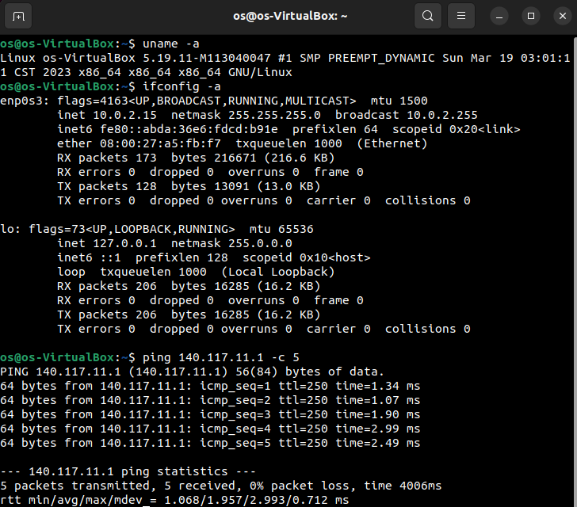

---
NSYSU 資工碩一
洪浩育 M113040047
HW1-PART1
---
<center>
    <h1> 
        OS-HW1-PART1</br>
        資工碩一 洪浩育 M113040047 
    </h1>
</center>

# How to compile Linux kernel<br>

## Reference
* https://www.cyberciti.biz/tips/compiling-linux-kernel-26.html

## Download kernel
* find the kernel version `uname -r`
* [linux kernel archives](https://www.kernel.org)
* [linux kernel archives](https://cdn.kernel.org/pub/linux/kernel/)
* extract tar.xz file using `tar -xvf linux-***.tar.xz`
* cd to extracted linux-*** folder
* `cp  -v /boot/config-$(uname -r) .config`
* open Makefile
* setting EXTRAVERSION = -M1130400477
* open .config
* setting CONFIG_SYSTEM_TRUSTED_KEYS from "debian/canonical-certs.pem" to ""
* setting CONFIG_SYSTEM_REVOCATION_KEYS from "debain/canonical-certs.pem" to ""

## Download compliers and other tools
* `sudo apt install build-essential libncurses-dev bison flex libssl-dev libelf-dev`


## compile
* `make -j $(nproc)`
* `sudo make modules_install`
* `sudo make install`
* `sudo update-initramfs -c -k {your kernel version}` {kernel version}=5.19.11-M113040047
* `sudo update-grub`
* `reboot`

## Result


## For TA
```
# ssh to my ssh server
# password: 0000
ssh -p 2022 os@140.117.169.41
```
